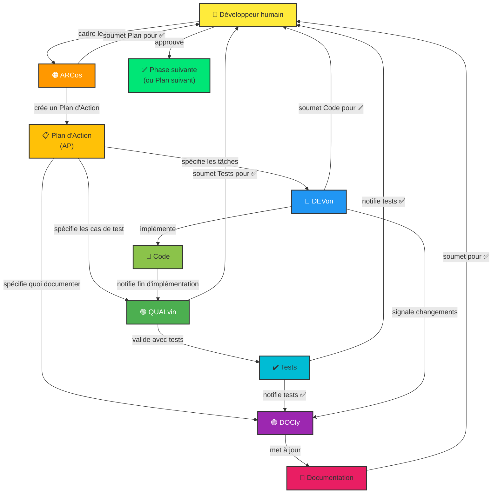

# Copilot Instructions – gestion-budget-serverless

Il s'agit du **backend Quarkus/Java 21** de l'application de gestion de budget, déployé sous forme de fonctions AWS Lambda natives. Le frontend se trouve dans le dépôt compagnon [`gestion-budget-ihm`](../gestion-budget-ihm) (React/TypeScript).

## Build, Test et Lint

```bash
# Construire tous les modules (mode JVM)
mvn clean package

# Construire un seul module
mvn clean package -f comptes/pom.xml

# Exécuter tous les tests
mvn test

# Exécuter une classe de test spécifique
mvn test -Dtest=ComptesServiceTest

# Exécuter une méthode de test spécifique
mvn test -Dtest=ComptesServiceTest#testGetComptes

# Exécuter les tests d'un seul module
mvn test -f operations/pom.xml

# Construire l'exécutable Linux natif pour Lambda (nécessite GraalVM/Mandrel)
mvn clean package -Pnative -Dquarkus.native.container-build=true

# Exécuter l'analyse SonarCloud (nécessite sonar.token)
mvn verify -Psonar
```

## Architecture

### Projet Maven multi-modules
```
gestion-budget-serverless/
├── communs/          # Bibliothèque partagée : classes de base, modèles, sécurité, exceptions
├── parametrages/     # Microservice : paramètres système  → /parametres/v2/
├── utilisateurs/     # Microservice : auth/profils utilisateur → /utilisateurs/v2/
├── comptes/          # Microservice : comptes bancaires   → /comptes/v2/
└── operations/       # Microservice : budgets et opérations → /budgets/v2/
```

Tous les microservices (`comptes`, `operations`, `parametrages`, `utilisateurs`) dépendent de `communs` et suivent la même structure interne en couches.

### Couches de l'architecture hexagonale (par microservice)
```
api/          – Contrôleurs REST JAX-RS, enums des chemins d'API, surcharges exception/sécurité
business/     – Logique métier (services @ApplicationScoped), interfaces de ports, modèles métier
spi/          – Adaptateurs base de données (MongoDB Panache), providers REST inter-services
config/       – Classes de configuration Quarkus (OpenAPI, hints de réflexion GraalVM)
utils/        – Classes utilitaires métier
```

### Patterns clés du framework

Les **ressources REST** étendent `AbstractAPIInterceptors` (de `communs`) et utilisent les annotations JAX-RS standard :
```java
@Path(ComptesAPIEnum.COMPTES_BASE)
public class ComptesResource extends AbstractAPIInterceptors {
    @Inject IComptesAppProvider services;

    @GET
    @RolesAllowed({ComptesAPIEnum.COMPTES_ROLE})
    @Operation(description = "...")
    public Uni<List<CompteBancaire>> getComptes() { ... }
}
```

**Programmation réactive** : toutes les méthodes de service et les appels base de données retournent `Uni<T>` (valeur unique) ou `Multi<T>` (flux) de Mutiny. Ne jamais bloquer avec `.await().indefinitely()` en dehors des tests.

**Injection de dépendances** : CDI uniquement (`@Inject`, `@ApplicationScoped`). Aucune annotation Spring.

**Interfaces de ports** : la logique métier est toujours masquée derrière une interface dans `business/ports/` (ex. `IBudgetAppProvider`, `IComptesRepository`). Les ressources REST injectent l'interface, pas l'implémentation.

**Sécurité** : chaque microservice surcharge `AbstractAPISecurityFilter` et `IJwtSecurityContext` de `communs`. Les endpoints déclarent `@RolesAllowed` avec les constantes de rôle de leur propre `*APIEnum`.

**Appels inter-services** : les services qui ont besoin de données d'autres microservices injectent une interface provider dans `spi/` (ex. `IComptesServiceProvider`, `IParametragesServiceProvider`) appuyée par un client REST Quarkus.

### Base de données
- **MongoDB** via Quarkus MongoDB Panache (pattern repository, pas Active Record).
- Chaîne de connexion : variable d'environnement `QUARKUS_MONGODB_CONNECTION_STRING` (par défaut `localhost:27017` en dev).
- Base dev : `v12-app-dev`. Base prod : variable d'environnement `QUARKUS_MONGODB_DATABASE`.
- La configuration se trouve dans `src/main/resources/dev/application.properties` et `src/main/resources/prod/application.properties` pour chaque module.

### `communs` module
Partagé entre tous les microservices :
- `api/AbstractAPIResource` – endpoint de base `/info`
- `api/AbstractAPIInterceptors` – intercepteurs de logs requête/réponse
- `api/security/AbstractAPISecurityFilter` – validation JWT
- `utils/security/JWTUtils`, `SecurityUtils` – parsing JWT, sanitation des entrées
- `utils/exceptions/` – exceptions typées (`DataNotFoundException`, `UserNotAuthorizedException`, etc.)
- `data/trace/BusinessTraceContext` – contexte de traçage style MDC réinitialisé après chaque réponse
- `aws-deploy/` – templates AWS SAM et configuration API Gateway

### Conventions de test
- Utiliser `@QuarkusTest` sur les classes de test.
- Mocker les dépendances avec `Mockito.mock()` / `Mockito.spy()` dans `@BeforeEach`.
- Résoudre les résultats réactifs dans les tests avec `.await().indefinitely()`.
- `communs` est publié sur GitHub Packages ; les POM des microservices le référencent en dépendance.

## Utilitaires métier clés

### `BudgetDataUtils` (`operations/.../utils/`)
- `cloneOperationToMoisSuivant(LigneOperation)` – clone une opération pour le mois suivant : tous les champs de `SsCategorie` doivent être copiés explicitement (id, libelle, **type**).
- `cloneOperationPeriodiqueToMoisSuivant(...)` – appelle `cloneOperationToMoisSuivant()` en interne, puis gère la périodicité. Un fix sur `cloneOperationToMoisSuivant` se propage automatiquement aux deux cas.

> ⚠️ Lors de tout ajout de champ dans `LigneOperation.SsCategorie` ou `LigneOperation.Categorie`, penser à l'ajouter aussi dans `cloneOperationToMoisSuivant()`.

## Déploiement
- La CI build d'abord `communs`, le publie sur GitHub Packages, puis build chaque microservice en parallèle en image native.
- Les images natives sont déployées sur AWS Lambda via SAM. Les routes d'API sont définies dans `communs/src/aws-deploy/`.
- SonarCloud s'exécute sur `master` une fois tous les builds terminés.


## 🤖 Les Agents et leurs Rôles

Quatre agents spécialisés travaillent ensemble, orchestrés par un **👤 Développeur humain** :

#### **🟠 ARCos** [v2.0]
- **Rôle :** Planificateur et orchestrateur technique
- **Responsabilités :**
  - Concevoir des solutions architecturales complètes
  - Créer et valider les Plans d'Action multi-phases
  - Décomposer les initiatives en tâches logiques
  - Orchestrer le travail entre Devon, Qalvin et Docly
  - Lire `.github/instructions/architect.instructions.md` au démarrage pour les spécificités du projet
- **Quand l'utiliser :** "Conçois une architecture pour...", "Crée un plan pour...", "Découpe ça en tâches"
- **Livrable :** Plans d'Action détaillés avec phases, tâches et dépendances

#### **🔵 DEVon** [v2.0]
- **Rôle :** Implémentateur de code de production
- **Responsabilités :**
  - Traduire les exigences en code fonctionnel et testé
  - Respecter les patterns architecturaux et conventions du projet
  - Mettre à jour les dépendances et refactoriser le code
  - Implémenter les optimisations de performance
  - Lire `.github/instructions/dev.instructions.md` au démarrage pour les spécificités du projet
- **Quand l'utiliser :** "Implémente cette fonctionnalité", "Développe selon l'architecture", "Code cette fonction"
- **Livrable :** Code propre, compilant et compilant sans erreurs

#### **🟢 QUALvin** [v2.0]
- **Rôle :** Expert en assurance qualité et tests
- **Responsabilités :**
  - Écrire des tests unitaires complets (composants, services, modèles)
  - Assurer une couverture de test ≥80%
  - Tester les cas limites et les scénarios d'erreur
  - Valider que le code fonctionne correctement
  - Lire `.github/instructions/qa.instructions.md` au démarrage pour les spécificités du projet
- **Quand l'utiliser :** "Écris des tests pour ce composant", "Génère des tests unitaires", "Valide avec des tests"
- **Livrable :** Tests passants avec rapports de couverture

#### **🟣 DOCly** [v2.0]
- **Rôle :** Gardien de la documentation
- **Responsabilités :**
  - Mettre à jour README, `docs/` et guides
  - Maintenir `docs/ARCHITECTURE.md` à jour avec l'état réel du projet
  - Créer les ADRs dans `docs/adr/` sur délégation d'ARCos
  - Documenter les changements architecturaux
  - Mettre à jour les instructions Copilot quand les agents changent
  - Garder la documentation en sync avec le code
  - Lire `.github/instructions/doc.instructions.md` au démarrage pour les spécificités du projet
- **Quand l'utiliser :** "Mets à jour la documentation", "Garde les docs en sync avec ce code", "Ajoute ça au README"
- **Livrable :** Documentation à jour, claire et complète


---

### 🔄 Workflow Typique

1. **Cadrage (👤 Développeur humain)** → Définir le besoin et les critères d'acceptation
2. **Planification (🟠 ARC - Arcos)** → Créer un Plan d'Action avec phases et tâches
3. **Validation Humaine** → Approuver le plan avant de lancer
4. **Implémentation (🔵 DEV - Devon)** → Coder les tâches assignées
5. **Validation Humaine** → Approuver le code avant tests
6. **Tests (🟢 QUAL - Qalvin)** → Écrire et valider les tests
7. **Validation Humaine** → Approuver les tests avant doc
8. **Documentation (🟣 DOC - Docly)** → Mettre à jour la documentation
9. **Validation Humaine** → Approuver la documentation
10. **Phase Suivante** → Lancer la phase suivante du plan (étape 2)

> 💡 **Parallélisation** : Les étapes 4→6 (DEVon) et 6→8 (QUALvin + DOCly) peuvent être parallélisées avec `/fleet` quand les tâches sont indépendantes.

---

## 📋 Plans d'Action et Suivi

Chaque initiative majeure (modernisation, nouvelle feature, refactoring) est orchestrée via un **Plan d'Action (AP)** :

- **Fichier plan :** `.github/plans/<NO>_<nom>.plan.md`
- **Rapports de phase :** `.github/plans/<NO>_reports/PHASE_N_...md`
- **Index des plans :** `.github/plans/README.md`
- **Guide complet :** `.github/PLANS.md`

Les Plans d'Action coordonnent le travail multi-phases et garantissent une traçabilité complète via les rapports.

## 📐 Instructions Spécifiques Projet (`.github/instructions/`)

Chaque agent lit au démarrage son fichier d'instructions spécifique au projet :

| Fichier | Agent | Contenu |
|---|---|---|
| `architect.instructions.md` | 🟠 ARCos | Conventions archi, couches, protocole SQL handoff |
| `dev.instructions.md` | 🔵 DEVon | Stack technique, versions, conventions de code |
| `qa.instructions.md` | 🟢 QUALvin | Framework de test, commandes CI, cas à couvrir |
| `doc.instructions.md` | 🟣 DOCly | Fichiers /docs, conventions de documentation |

Ces fichiers contiennent les valeurs **spécifiques au projet** (versions réelles, chemins, noms de fichiers).  
Les agents génériques (`.github/agents/`) restent inchangés entre projets.

> Pour initialiser ces fichiers : utiliser le prompt `init-copilot-instructions`.  
> Pour les mettre à jour : utiliser le prompt `update-copilot-instructions`.

---

## 📊 Relations entre Agents (Diagramme Mermaid)



---
